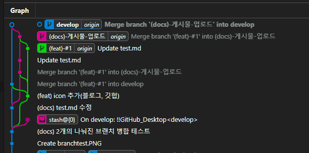

## (feat)branch와 (docs) 게시물 추가 branch 를 각각 별도로 생성한후 merge하면 어떻게 되는가...

(feat)branch와 (docs) 게시물 추가 branch 를 각각 별도로 생성한후 merge하면 어떻게 되는가에 대해서 실험을 해보고자합니다.

develop branch에서 (feat) #1 branch를 생성하고, 마찬가지로 develop branch에서 (docs) 게시물 업로드 branch를 생성합니다.

</img>

위와 같이 2개의 branch를 작성한후 docs 게시물 업로드 branch를 develop branch로 우선 merge합니다.

이후 (feat) #1 branch를 develop branch로 merge합니다.

각 두개의 branch 사이에 서로 중복되어 작업된 파일이 없으므로 정상적으로 병합되어야 합니다.

확인합니다.

음...

feat branch 를 A branch라고 가정하고
docs branch를 B branch라고 가정합니다.

A branch 병합후 B branch를 develop branch에 병합하였을 때 기대했었던 값은.
a branch의 변경사항도 정상적으로 병합되고 b branch의 변경사항도 정상적으로 병합되어야 했습니다.
하지만 a branch 병합후 b branch 를 병합하였을 때 기존 a branch 병합사항을 원래대로 되돌리고 b branch의 변경사항면 병합되었습니다.
해당 사항을 해결하기 위해서...

그 와중 inssue 하나 마크다운 파일에서 img태그를 닫지 않으면 제대로 작동하지 않네요.

docs branch를 먼저 feat branch에 merge한후
해당 feat branch를 다시 develop branch에 merge?

다시 feat branch상태에서 docs를 수정해서 docs에 merge
후. 다시 develop branch에 머지했습니다...

</img>

중간에 merge 할때마다 commit을 입력해야했는데 해당 과정이 제대로 이루어졌는지를 알 수 없어서 각각 제대로 작동했는지 확인해야 했습니다.

제가 branch 병합에 대해서 제대로 이해한게 맞는지는 모르겠는데
하나의 develop branch에서 두개의 branch로 나누어 작업한후 각각의 branch를 develop branch로 병합하기 위해서는
A와 B 두개의 branch를 A를 B에 혹은 B를 A에 병합한 후 (병합도중 충돌되는 부분들을 수정하여)
이를 다시 develop branch로 병합해야 한다.... 라고 이해했습니다...
이것이 제대로 이해한것인지 확인하기 위해 해당 develop branch를 main branch에 병합하겠습니다.
(docs branch -> develop branch 병합 후 -> main branch 병합)
